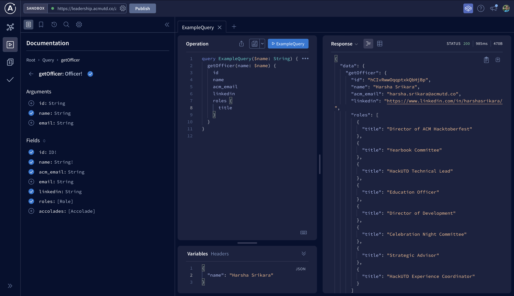

# GraphQL API

To view the production GraphQL API click [here](https://leadership.acmutd.co/api/graphql).

### Local Setup

To test the GraphQL API locally follow these steps:

 - Follow the setup and launch steps described in [Leadership - Quick Start](./leadership-site.md).
 - Open the GraphQL API endpoint at `http://localhost:3000/api/graphql`
 - Click `Query your server` to open Apollo Studio. Note: Make sure to a compliant browser like Chrome.


:::tip
Apollo Studio is the most convenient web-based tool for working with the Leadership GraphQL API. However, it is also possible to use Postman or other tools to interact with the API. For more information see [Postman - GraphQL Support](https://learning.postman.com/docs/sending-requests/supported-api-frameworks/graphql/).
:::

 - Sign into the leadership site & navigate to `http://localhost:3000/settings` and generate a new Access Token.


:::caution
An Access Token generated locally (at `http://localhost:3000/settings`) will only work when testing the [local GraphQL endpoint](http://localhost:3000/api/graphql). An Access Token created in the [production instance](https://leadership.acmutd.co/settings) will only work on the [production GraphQL endpoint](https://leadership.acmutd.co/api/graphql).
:::

 - Copy the token (it should start with `eyJ`) and add it as a header in Apollo Studio as follows `Authorization: Bearer <API KEY>`.


 - The schema and queries for the GraphQL API should now be visible.



 - Start using the api! Here's a sample query to get you started.

```
query ExampleQuery {
  getOfficers {
    id
    name
  }
}
```

